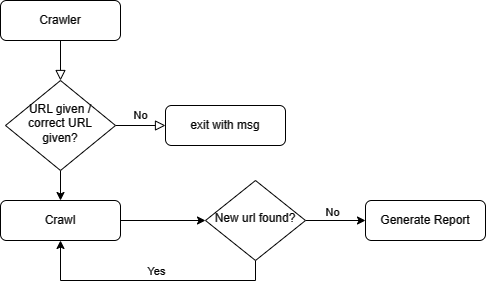
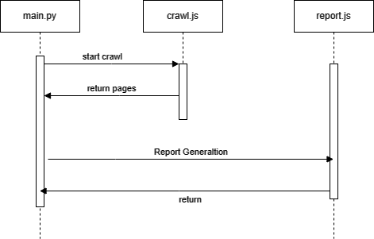

# webcrawler

## Usage
```bash
npm run start <url>
```

Replace <url> with a valid URL (e.g., `https://example.com`).
```bash
npm run start https://google.com
```

## Flow
### 1


### 2


## Demonstration
